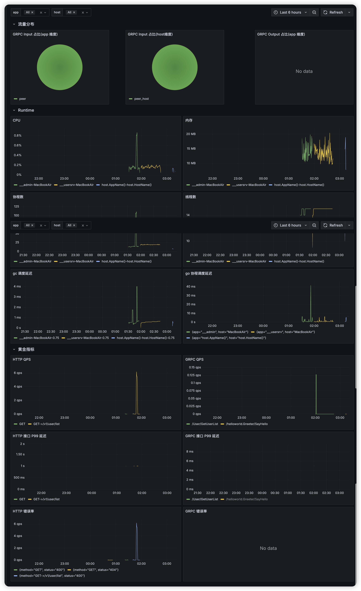

# metrics-middleware

Metrics-middleware 是一个用于监控指标的中间件，支持 Gin HTTP 服务器和 gRPC 服务器/客户端的指标监控。提供了完整的监控链路，包括服务端、客户端和数据库层面的指标采集，并集成了 Grafana 监控面板。

## 目录

- [功能特点](#功能特点)
- [快速开始](#快速开始)
  - [安装](#安装)
  - [Gin Web 框架使用示例](#gin-web-框架使用示例)
  - [gRPC 服务端使用示例](#grpc-服务端使用示例)
  - [gRPC 客户端使用示例](#grpc-客户端使用示例)
- [项目结构](#项目结构)
  - [内置指标](#内置指标-pkgmetric)
  - [中间件实现](#中间件实现)
  - [Grafana 配置](#grafana-配置-pkgmetricgrafana)
- [自定义指标](#自定义指标)
  - [Counter 计数器](#counter-计数器)
  - [Gauge 仪表盘](#gauge-仪表盘)
  - [Histogram 直方图](#histogram-直方图)
  - [全局标签](#全局标签)
  - [指标命名规范](#指标命名规范)
- [依赖](#依赖)
- [贡献](#贡献)
- [许可证](#许可证)

## 功能特点

- 支持 Gin Web 框架的指标监控
- 支持 gRPC 服务端和客户端的指标监控
- 提供完整的监控链路：客户端、服务端、数据库层面
- 集成 Grafana 监控面板配置
- 使用 Prometheus 作为指标收集系统
- 支持自定义内置指标

## 快速开始

### 安装

```bash
go get github.com/qdxiao/metrics-middleware
```

### Gin Web 框架使用示例

```go
package main

import (
    "github.com/gin-gonic/gin"
    metric2 "github.com/qdxiao/metrics-middleware/metric"
    "github.com/qdxiao/metrics-middleware/pkg/metric"
    "github.com/qdxiao/metrics-middleware/pkg/metric/gin-metrics/ginmetrics"
)

func main() {
    r := gin.Default()

    // 注册默认 runtime 指标
    metric.NewBuiltinMetric(
        metric2.NewCustomMetricsRegistry(),
        metric.WithEnableGo(true),
        metric.WithEnbaleProcess(true),
    )

    // 获取全局 Monitor 对象
    m := ginmetrics.NewMonitor(
        "serverName",
        ginmetrics.WithMetricPath("/metrics"), // 指定的 metrics 路径
    )

    m.Use(r)

    r.GET("/product/:id", func(ctx *gin.Context) {
        ctx.JSON(200, map[string]string{
            "productId": ctx.Param("id"),
        })
    })

    _ = r.Run()
}
```

### gRPC 服务端使用示例

```go
package main

import (
    "context"
    "flag"
    "fmt"
    "log"
    "net"

    "github.com/gin-gonic/gin"
    "github.com/prometheus/client_golang/prometheus/promhttp"
    "github.com/qdxiao/metrics-middleware/pkg/metric"
    serverinterceptors "github.com/qdxiao/metrics-middleware/pkg/metric/rpc-metrics/server"
    "google.golang.org/grpc"
)

func main() {
    flag.Parse()
    lis, err := net.Listen("tcp", fmt.Sprintf(":%d", *port))
    if err != nil {
        log.Fatalf("failed to listen: %v", err)
    }

    s := grpc.NewServer(
        // 添加指标拦截器
        grpc.UnaryInterceptor(
            serverinterceptors.UnaryPrometheusInterceptor(),
        ),
    )

    // 注册服务
    pb.RegisterGreeterServer(s, &server{})

    // 启动 Prometheus metrics 服务
    go func() {
        metric.NewBuiltinMetric(
            metric2.NewCustomMetricsRegistry(),
            metric.WithEnableGo(true),
            metric.WithEnbaleProcess(true),
        )

        r := gin.Default()
        r.GET("/metrics", func(ctx *gin.Context) {
            promhttp.HandlerFor(metric2.NewCustomMetricsRegistry(), promhttp.HandlerOpts{
                Registry: metric2.NewCustomMetricsRegistry(),
            }).ServeHTTP(ctx.Writer, ctx.Request)
        })
        r.Run(":8080")
    }()

    if err := s.Serve(lis); err != nil {
        log.Fatalf("failed to serve: %v", err)
    }
}
```

### gRPC 客户端使用示例

```go
package main

import (
    "context"
    "flag"
    "log"
    "time"

    "github.com/qdxiao/metrics-middleware/pkg/metric/rpc-metrics/client"
    "google.golang.org/grpc"
    "google.golang.org/grpc/credentials/insecure"
)

func main() {
    flag.Parse()

    conn, err := grpc.NewClient(
        *addr,
        grpc.WithTransportCredentials(insecure.NewCredentials()),
        // 添加指标监控拦截器
        grpc.WithUnaryInterceptor(client.PrometheusInterceptor()),
    )
    if err != nil {
        log.Fatalf("did not connect: %v", err)
    }
    defer conn.Close()
    
    // 使用连接...
}
```

## 项目结构

### 内置指标 (`pkg/metric/`)

1. 基础指标定义 (`metrics.go`)
```go
const (
    Namespace = "gfast"
    TypeHttp  = "http"
    TypeGrpc  = "grpc"
    TypeMysql = "mysql"
)
```

2. 内置运行时指标 (`builtin-metrics.go`)
- Go Runtime 指标
- 进程指标
- 支持自定义采集器

3. 服务端指标 (`server.go`)
- 请求处理时间直方图：`server_handle_seconds`
    - 标签：method, type, status, peer, peer_host
- 请求总数计数器：`server_handle_total`
    - 标签：method, type, peer, peer_host
- 客户端请求时间直方图：`client_handle_seconds`
    - 标签：method, type, server
- 客户端请求总数：`client_handle_total`
    - 标签：method, type, server

4. 数据库指标 (`database.go`)
- 数据库操作计数器：`database_lib_handle_total`
    - 标签：type, method, name, server

### 中间件实现

1. Gin Web 框架中间件 (`pkg/metric/gin-metrics/`)
- 自动采集 HTTP 请求指标
- 支持自定义 metrics 路径
- 集成 Prometheus 采集端点

2. gRPC 中间件 (`pkg/metric/rpc-metrics/`)
- 客户端拦截器：自动采集 gRPC 客户端调用指标
- 服务端拦截器：自动采集 gRPC 服务端请求指标

### Grafana 配置 (`pkg/metric/grafana/`)

1. 默认仪表盘配置文件：`默认指标监控-1744569190739.json`
    - 包含预配置的可视化面板
    - 支持一键导入 Grafana

2. 监控面板预览：


监控面板包含以下主要指标：
- 流量分布指标
- Runtime 系统指标
- GC 相关指标
- 服务黄金指标（QPS、延迟、错误率等）

## 自定义指标

除了内置的监控指标外，该中间件还支持使用 `metric` 包来自定义指标：

### Counter 计数器

```go
counter := metric.NewCounterVec(metric.NewCustomMetricsRegistry(), &metric.CounterVecOpts{
    Namespace: "myapp",
    Subsystem: "requests",
    Name:      "total",
    Help:      "Total number of requests",
    Labels:    []string{"method", "path"},
})

// 使用
counter.Inc("GET", "/api/users")  // 增加 1
counter.Add(2, "POST", "/api/users")  // 增加指定值
```

### Gauge 仪表盘

```go
gauge := metric.NewGaugeVec(metric.NewCustomMetricsRegistry(), &metric.GaugeVecOpts{
    Namespace: "myapp",
    Subsystem: "resources",
    Name:      "connections",
    Help:      "Number of active connections",
    Labels:    []string{"type"},
})

// 使用
gauge.Set(100, "tcp")  // 设置值
gauge.Inc("tcp")       // 增加 1
gauge.Add(10, "tcp")   // 增加指定值
```

### Histogram 直方图

```go
histogram := metric.NewHistogramVec(metric.NewCustomMetricsRegistry(), &metric.HistogramVecOpts{
    Namespace: "myapp",
    Subsystem: "requests",
    Name:      "duration_ms",
    Help:      "Request duration in milliseconds",
    Labels:    []string{"method"},
    Buckets:   []float64{5, 10, 25, 50, 100, 250, 500, 1000}, // 自定义分布区间
})

// 使用
histogram.Observe(42, "GET")  // 记录一个观察值
```

### 全局标签

所有通过 `NewCustomMetricsRegistry()` 创建的指标都会自动添加以下全局标签：
- `app`: 应用名称
- `host`: 主机名

### 指标命名规范

- Namespace: 通常是应用名称
- Subsystem: 表示子系统或模块
- Name: 具体的指标名称
- Labels: 用于多维度数据分析的标签

## 依赖

- gin-gonic/gin: Web 框架
- prometheus/client_golang: Prometheus 客户端
- google.golang.org/grpc: gRPC 框架

## 贡献

如果您发现任何问题或有改进建议，欢迎：

1. 提交 Issue：描述您遇到的问题或建议
2. 提交 Pull Request：
   - Fork 本仓库
   - 创建您的特性分支 (`git checkout -b feature/AmazingFeature`)
   - 提交您的修改 (`git commit -m 'Add some AmazingFeature'`)
   - 推送到分支 (`git push origin feature/AmazingFeature`)
   - 开启一个 Pull Request

## 许可证

本项目采用 MIT 许可证 - 查看 [LICENSE](LICENSE) 文件了解详细信息。